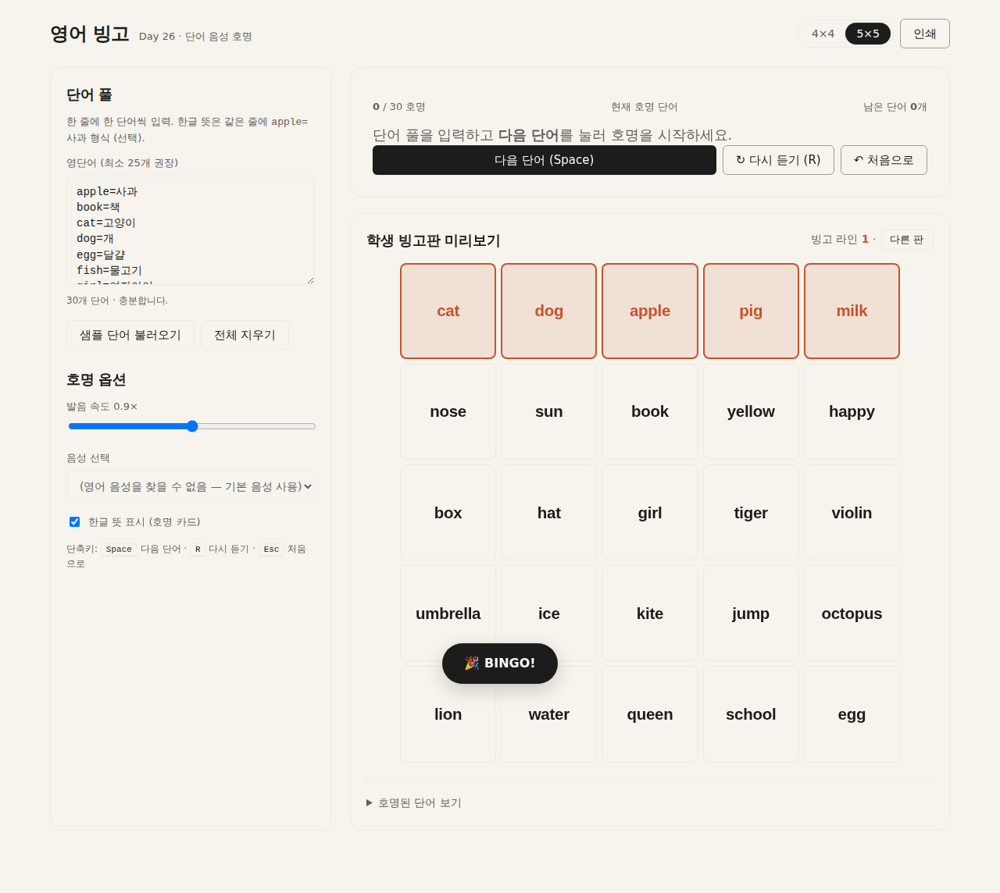

# Day 26 · 영어 빙고 — 단어 음성 호명

> 1일 1바이브코딩 챌린지 — 100개 토픽 중 #026. 초등 영어 듣기·읽기 동시 훈련용 교실 빙고 도구.



## 핵심 기능
- **단어 풀 입력 → 빙고판 자동 생성**: `apple=사과` 형식으로 한 줄씩 입력. 4×4(16칸) 또는 5×5(25칸) 토글.
- **교사 호명 모드**: 단어 풀에서 무작위 1개씩 호명. Web Speech API로 영어 발음(en-US), 한글 뜻 토글, "다시 듣기" / "처음으로" 지원.
- **자동 BINGO 감지**: 학생이 자기 칸 클릭 → 가로·세로·대각선 라인 자동 검출, 완성 라인 색상 강조 + 배너 표시.
- **인쇄 (A4 2판)**: 같은 단어 풀로 무작위가 다른 보드 2장을 한 번에 인쇄. 모둠별 다른 판 배포 용이.
- **단축키**: `Space` 다음 단어 · `R` 다시 듣기 · `Esc` 처음으로.
- **localStorage 보존**: 단어 풀·속도·음성·뜻 토글 새로고침 후 유지.

## 실행 방법
완전한 단일 HTML. 추가 의존성·빌드 없음.

```bash
# 로컬에서
python3 -m http.server 5180 --directory .
# → http://localhost:5180/
```

또는 배포된 GitHub Pages를 바로 열기:
- https://989-alt.github.io/project-26-yeongeo-bingo/

## 기술 스택
- 단일 HTML / vanilla CSS / vanilla JS — 외부 CDN 의존 0
- Web Speech API (`speechSynthesis`) — 영어 단어 발음
- `@media print` — A4 인쇄 전용 레이아웃
- localStorage — 설정·단어 풀 보존
- Gemini API **미사용** (이 토픽엔 자연어 생성 불필요)

## 적용한 skill
- `brainstorming` — MUST / SHOULD / MUST NOT 기능 정리 (`docs/plans/01-brainstorm.md`)
- `ui-ux-pro-max` — Lovable 디자인 적용 (`docs/plans/02-ui-ux.md`)
- `senior-devops` — 코드 작성·구조 (CI/CD 무시, 코드 품질만 적용)
- `webapp-testing` — Playwright e2e 15케이스 (`tests/e2e.py`)

## 디자인 브랜드
**Lovable** (`awesome-design-md` 컬렉션) — warm cream 배경 (#f7f4ed), charcoal 텍스트, opacity 기반 그레이, 둥근 모서리 6/12/16px, inset shadow 다크 버튼.

## 개인정보 보호
- 학생 이름·번호·점수 입력란 없음. 결과 수집 기능 없음.
- 모든 데이터 localStorage 단독 저장. 서버 통신 0건.
- 카메라/마이크 접근 0건.

## 테스트
```bash
pip install playwright && python3 -m playwright install chromium
python3 /path/to/with_server.py \
  --server "python3 -m http.server 5180 --directory $(pwd)" --port 5180 \
  -- python3 tests/e2e.py
```
15/15 통과. 스크린샷은 `tests/artifacts/`.

---

Day 1 = 2026-05-13. Day 26 = 2026-06-07. 다음 토픽은 #027 가상 실로폰·마림바.
